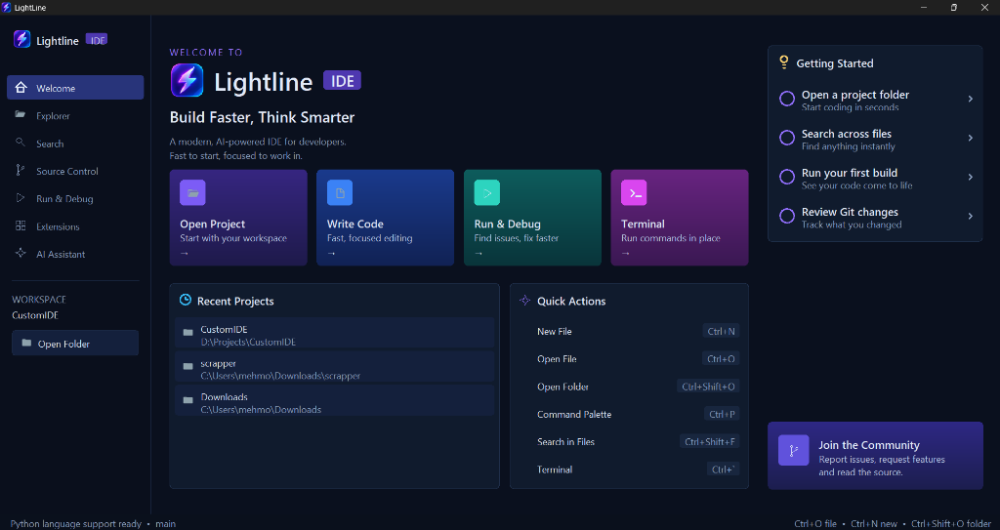

<div align="center">


# LightLine

**A lightning-fast, lightweight native Windows code editor written in Rust.**

[](https://github.com/mehmoodulhaq570/LightLine/actions/workflows/rust.yml)
[](https://github.com/mehmoodulhaq570/LightLine/releases/latest)
[](#requirements)
[](Cargo.toml)
[](Cargo.toml)

<br>



</div>

---

## Highlights

- ⚡ **Native Performance**: Built directly on Rust and Win32 GDI. Sub-20ms launch time, minimal memory consumption, zero Electron or web view overhead.
- 📦 **Zero-Dependency Portable Binary**: Single ~5.2 MB executable. Download and double-click — no installers, extra runtimes, or admin privileges needed.
- 🌲 **Tree-sitter Syntax Coloring**: High-speed, background-worker semantic highlighting for Rust and Python with smart incremental re-parsing.
- 🧠 **Integrated Language Support (LSP)**: Automatic background support for **rust-analyzer** and **Pyright** (self-installing): diagnostics, hover (`F1`), go-to-definition (`F12`), find references (`Shift+F12`), autocompletion (`Ctrl+Space`), and formatting (`Shift+Alt+F`).
- 🎨 **Real Prettier + Formatter Framework**: Formatting runs through a generic, timeout-protected `Formatter` interface — Prettier is the first implementation, with `Shift+Alt+F` Format Document and an optional Format on Save setting, and room for rustfmt/Black/clang-format next.
- 💻 **Multi-Session Terminal**: Persistent ConPTY terminal with multiple tabs and full VT100/ANSI support, cleanly separated from the read-only build/run **Output** stream — and the Output pane now correctly takes keyboard input while your program is actually running.
- 🗂️ **Workspaces & Project Drawer**: Quick Open (`Ctrl+P`), project-wide content search (`Ctrl+Shift+F`), and folder tree navigation.
- 🌿 **Source Control**: Stage, commit and discard from the sidebar (`Ctrl+Shift+G`). Separate Staged and Changes lists, word status labels, ahead/behind branch chip, side-by-side diff review that jumps into the file, recent commit history, and Push/Pull/Fetch handed to Git Credential Manager.
- 🐞 **Interactive Debugger**: Built-in Debug Adapter Protocol (DAP) client communicating with `lldb-dap`. Single-key build and launch (`F5`), editor gutter breakpoints, stepping (`F10`, `F11`, `Shift+F11`), expandable variable scope trees (locals, registers, nested struct/collection values), and call stack navigation. Run/Debug now also compiles and runs **C/C++** directly, alongside Python and Rust.
- 🧩 **Real Zed Extensions**: The Extensions panel (`Ctrl+Shift+X`) installs actual extensions from the live [Zed registry](https://github.com/zed-industries/extensions) — search any extension by name, install/uninstall for real. Material Icon Theme ships this way out of the box (1000+ real icons), and installing a Zed **color theme** (e.g. Dracula) changes LightLine's editor colors live, no restart.
- ⚙️ **User Configuration**: JSON-backed settings at `%APPDATA%\LightLine\settings.json` (`Ctrl+,`) for fonts, indentation, colors, and behavior — including tab size, auto-indent, and format-on-save, all of which actually take effect.
- 💾 **Session Restore**: Automatically reopens your last workspace, tabs, cursor positions, and scroll offsets on launch.

---

## Download & Quick Start

### Portable Binary (Recommended)
Grab the latest build from **[GitHub Releases](https://github.com/mehmoodulhaq570/LightLine/releases/latest)**:
- **[`lightline.exe`](https://github.com/mehmoodulhaq570/LightLine/releases/latest)**: Direct standalone executable.
- **[`lightline-v0.1.0-windows-x86_64.zip`](https://github.com/mehmoodulhaq570/LightLine/releases/latest)**: Archive bundling the executable, README, and CHANGELOG.

### Build from Source
Ensure you have the Rust toolchain installed on Windows 10/11:
```powershell
git clone https://github.com/mehmoodulhaq570/LightLine.git
cd LightLine
cargo run --release
```

---

## Keyboard Shortcuts

| Shortcut | Action |
| --- | --- |
| `Ctrl+P` | **Quick Open** files; type `>` for Command Palette |
| `Ctrl+,` | **Open Settings** (`settings.json`) |
| `Ctrl+N` / `Ctrl+W` | New tab / Close active tab |
| `Ctrl+O` / `Ctrl+S` | Open file / Save active file |
| `Ctrl+Shift+O` | Open Folder (Workspace) |
| `Ctrl+\` | Split editor vertically / Unsplit |
| `Ctrl+1` / `Ctrl+2` | Focus left or right split pane |
| `Ctrl+B` | Toggle sidebar (Explorer, Search, Git, Debug, Extensions) |
| `Ctrl+Shift+D` | Toggle **Run & Debug** panel |
| `Ctrl+Shift+X` | Toggle **Extensions** panel |
| `Ctrl+F` | Find in current file (`F3` / `Shift+F3` next / previous) |
| `Ctrl+Shift+F` | Search across workspace files |
| `Ctrl+Shift+G` | **Source Control**: stage, commit, diff review |
| `↑` / `↓` / `Enter` / `Space` | In the source control list: move, open diff, stage or unstage |
| `F5` / `Shift+F5` | Debug: Start & Continue / Stop session |
| `F10` | Debug: Step Over |
| `F11` / `Shift+F11` | Debug: Step Into / Step Out |
| Gutter Click | Toggle line breakpoint (red gutter dot) |
| `Ctrl+Shift+R` | Run the active file (Python, C/C++, or Rust — detected automatically) |
| `Ctrl+Shift+B` | Run Rust tests (`cargo test`) |
| `Ctrl+\`` | Toggle terminal panel |
| `Ctrl+Shift+\`` | Open a new terminal tab |
| `F1` | Show hover documentation at cursor |
| `F12` | Go to symbol definition |
| `Shift+F12` | Find all references to the symbol at cursor |
| `Ctrl+Space` | Trigger autocompletion popup |
| `Shift+Alt+F` | Format active document (Prettier, or the active language server) |
| `Ctrl++` / `Ctrl+-` / `Ctrl+0` | Zoom UI in / out / reset to 100% |

---

## User Settings

Open settings with **`Ctrl+,`** or run **`>Open Settings (JSON)`** from `Ctrl+P`. The file is stored at `%APPDATA%\LightLine\settings.json`; any field you omit keeps its default:

```json
{
  "fontFamily": "Consolas",
  "fontSize": 14,
  "tabSize": 4,
  "insertSpaces": true,
  "wordWrap": false,
  "autoClosePairs": true,
  "autoIndent": true,
  "formatOnSave": false,
  "bracketMatching": true,
  "indentGuides": true,
  "minimap": false,
  "smoothScrolling": false,
  "parseLimitKb": 128,
  "colors": {
    "editorBg": "#141820",
    "text": "#d8dee9",
    "selectBg": "#264f78",
    "keyword": "#4a90e2",
    "string": "#a3be8c",
    "comment": "#6b7280"
  }
}
```

`tabSize`, `insertSpaces`, and `autoIndent` drive real editor behavior (indentation on Enter, tab-width rendering, the status bar's "Spaces: N" indicator) — they're not just stored. `formatOnSave` runs the active formatter (Prettier today) before every save. `colors` overrides any of LightLine's core theme fields by name — the same fields a Zed color-theme extension maps onto (see below); anything you don't set keeps LightLine's default dark palette.

---

## Language & Debugger Requirements

- **Rust**: For language intelligence, install components with:
  ```powershell
  rustup component add rust-analyzer rust-src
  ```
- **Debugger (LLDB)**: For native Rust debugging via DAP (`F5`), ensure `lldb-dap` (bundled with LLVM or Visual Studio C++ Build Tools) is present on your system `PATH`.
- **Python**: For Python diagnostics and hover, install Node.js once (e.g. `winget install OpenJS.NodeJS.LTS`). LightLine automatically downloads and manages Pyright into `%APPDATA%\LightLine\pyright`.
- **Prettier** (JS/TS/JSON/CSS/HTML/Markdown/YAML formatting): install `prettier` globally (`npm install -g prettier`) or have it available via `npx`. LightLine only detects it — it never installs or modifies anything outside its own extensions folder on your behalf.

---

## Extensions

The Extensions panel (`Ctrl+Shift+X`) installs real extensions from the live [Zed extension registry](https://github.com/zed-industries/extensions) — LightLine is not building its own marketplace; it reads Zed's. Search any extension by name or ID and click Install; it's cloned via `git` into `%APPDATA%\LightLine\extensions\<id>`.

Two extension types are supported today, both pure data (no extension code runs inside LightLine):

- **Icon themes** — map file/folder names to SVG icons. **Material Icon Theme** installs automatically on first launch.
- **Color themes** — map editor/chrome/syntax colors onto LightLine's `Theme`. Installing one (e.g. **Dracula**) updates the running editor's colors immediately, with no restart; anything a theme doesn't specify keeps LightLine's own default. Uninstalling it reverts to the default theme.

Any other extension type (language servers, procedural/WASM extensions) is reported as not supported yet rather than silently half-installed.

---

## Project Documentation

- [v0.1 Architecture Document](docs/ARCHITECTURE.md)
- [Reference Visual Adaptation](design/REFERENCE_ADAPTATION.md)
- [Version Changelog](CHANGELOG.md)
