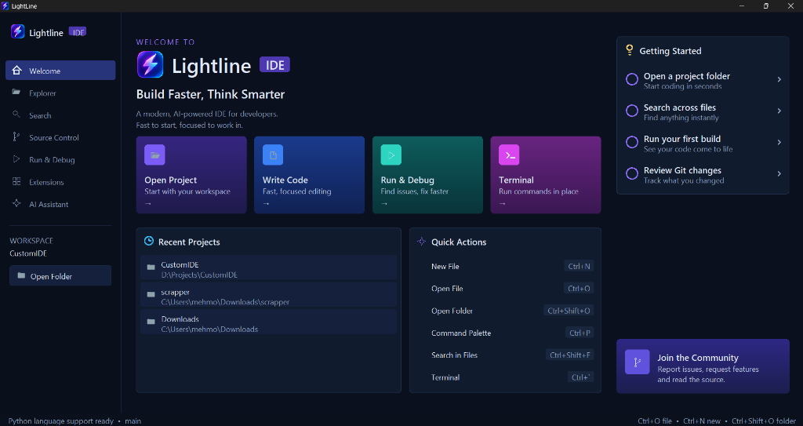

<div align="center">


# LightLine

**A fast, lightweight code editor for Windows, written in Rust.**

[](https://github.com/mehmoodulhaq570/LightLine/actions/workflows/rust.yml)
[](https://github.com/mehmoodulhaq570/LightLine/releases/latest)
[](#get-started)
[](Cargo.toml)
[](LICENSE)

<br>



</div>

---

LightLine is a code editor that feels like VS Code but starts fast and stays light. It's a single portable `.exe`: no installer, no Electron, no admin rights. It draws its own window straight through Windows, so it uses little memory and keeps typing and scrolling smooth: in our tests it starts in under a tenth of a second, a keystroke reaches the screen in about 3 ms, and LightLine idling in the background doesn't wake up at all.

## Features

- **Smart editing**: syntax colors, code folding, bracket matching, find and replace, multiple cursors, word wrap, and a split editor.
- **Unsaved-work recovery**: periodic local checkpoints for modified files and untitled text, with a Restore/Discard choice after restarting. If LightLine ever crashes, it saves your unsaved work first. Cursor movement and deletion preserve combined characters and joined emoji.
- **Stays in step with your files**: files changed by another program reload by themselves; if you have unsaved edits, saving asks whether to keep your version or reload.
- **Language support**: errors as you type and a Problems panel, completions with fill-in arguments, parameter hints, inline type hints, highlighted uses of the name at the caret, go to definition and to symbols in the file or the whole project, rename across files, quick fixes, organize imports, and hover docs for Rust, Python, C/C++, JavaScript/TypeScript and Go, through their language servers.
- **Run and debug**: run Python, C/C++, JavaScript, TypeScript, Go or Rust with one key, and debug Rust and Python with breakpoints, stepping and variables.
- **Saved Run configurations**: choose an entry file or command, arguments, environment variables and working directory in a panel that follows LightLine's theme. Each workspace remembers its configurations and selected default.
- **Git built in**: see changed lines in the margin, then stage, commit, push and review diffs without leaving the editor.
- **Terminal**: PowerShell, Command Prompt, Git Bash or WSL, in tabs.
- **Markdown preview**: see your README rendered beside the file as you type.
- **Private AI Assistant (optional)**: ask about your code using a model on your own PC through [Ollama](https://ollama.com). Off until you turn it on.
- **Themes and icons**: install color and icon themes from the Zed extension registry.
- **Picks up where you left off**: your folder, tabs and cursor positions come back when you reopen it.

## Get started

1. Download **`lightline.exe`** from the [latest release](https://github.com/mehmoodulhaq570/LightLine/releases/latest). It needs Windows 10 or 11. On a Windows on ARM PC, such as a Snapdragon laptop, download **`lightline-arm64.exe`** instead.
2. Double-click it. That's it; there's nothing to install.

**Or install it with [Scoop](https://scoop.sh)**, which also keeps it up to date:

```powershell
scoop bucket add lightline https://github.com/mehmoodulhaq570/LightLine
scoop install lightline
```

Update with `scoop update lightline`. Scoop adds LightLine to the Start menu and lets you run `lightline` from any terminal.

LightLine isn't code-signed yet, so Windows may show **"Windows protected your PC"** the first time. Click **More info**, then **Run anyway**. To check your download is genuine first, compare it with the release's `SHA256SUMS.txt` ([how to](docs/USER_GUIDE.md#verifying-a-download)).

**Build it yourself** (needs [Rust](https://rustup.rs)):

```powershell
git clone https://github.com/mehmoodulhaq570/LightLine.git
cd LightLine
cargo run --release
```

## Essential shortcuts

| Shortcut | Action |
| --- | --- |
| `Ctrl+P` | Open a file by name; type `>` for all commands |
| `Ctrl+Shift+O` | Open a folder |
| `Ctrl+F` / `Ctrl+H` | Find / replace |
| `Ctrl+Shift+F` | Search all files |
| `Ctrl+Shift+R` | Run the selected configuration, or detect the current file automatically |
| `F5` | Start debugging |
| `` Ctrl+` `` | Show or hide the terminal |
| `Ctrl+Shift+G` | Source control |
| `Ctrl+B` | Show or hide the side panel |
| `Ctrl+,` | Settings |

See the **[User Guide](docs/USER_GUIDE.md)** for every shortcut and setting, and how to set up Rust, Python, debugging, formatting and the AI Assistant.

## Run your code

Click **Run** or press **Ctrl+Shift+R**. No runner extension is needed; install the language's runtime or compiler first. JavaScript uses Node.js, TypeScript/JSX/TSX uses `tsx`, Go runs a package or standalone file, and Rust uses Cargo or `rustc`. Python uses the selected interpreter, and C/C++ uses GCC or Clang. JavaScript/TypeScript projects use their `start` or `dev` script when one is available. Programs run in **Output**, accept keyboard input, and retain their output and exit status. Use **Stop Running Program** in the Command Palette to stop a run.

Open **... → Run Configurations...** in the editor, or **Run: Configure / Select Saved Configuration** in the Command Palette, to customize a run. Click **New**, fill in the fields, then **Save & Select**. Arguments use one line per argument; environment variables use one `NAME=value` per line. Paths are relative to the workspace. **Automatic** restores language detection.

The dropdown beside **Run** shows the selected configuration and switches between saved configurations and **Automatic** without opening the full panel. Choose **Configure...** to edit configurations. Missing runtimes or compilers show a LightLine error message with setup guidance; install the tool, add it to PATH, and restart the editor.

The panel uses LightLine's own controls, theme and fonts, with keyboard navigation, clipboard editing and scrolling in smaller windows. Configurations are saved in the workspace's `.lightline/run.json`; environment values apply only to the launched program and its children. See [Direct language runners](docs/USER_GUIDE.md#direct-language-runners) and [Saved Run configurations](docs/USER_GUIDE.md#saved-run-configurations) for setup and shortcuts.

## Documentation

- [User Guide](docs/USER_GUIDE.md): shortcuts, settings, language setup, AI Assistant, extensions
- [Changelog](CHANGELOG.md): what's new in each release
- [Contributing](CONTRIBUTING.md) and [Code of Conduct](CODE_OF_CONDUCT.md)
- [Architecture](ARCHITECTURE.md): how LightLine is built

## Privacy

LightLine collects no usage data and sends nothing on its own. It uses the network only when you:

- search for or install extensions;
- push, pull or fetch with Git;
- run **Python: Install debugpy**;
- allow web images in a Markdown preview;
- open a Python file without Pyright installed, when it asks before downloading Pyright.

LightLine stores preferences, caches and, if it ever crashes, a `crash.log` in `%APPDATA%\LightLine`; the log stays on your PC. It edits the files you open, and saves Run configurations in the workspace's `.lightline/run.json`. Standalone Rust runs and configured C/C++ runs create executables in a `lightline-run` folder in your temp directory; runtimes, compilers and project commands may create their own files or use the network. **Python: Install debugpy** also installs into your Python. To remove LightLine, delete `lightline.exe` and, if you like, `%APPDATA%\LightLine`.

## Code signing policy

Free code signing provided by [SignPath.io](https://signpath.io), certificate by [SignPath Foundation](https://signpath.org). Signing will start once the project is approved; until then, releases are unsigned.

Release builds of `lightline.exe` are built from this repository by the GitHub Actions [release workflow](.github/workflows/release.yml). Only binaries built from this repository's source are signed.

| Role | Member |
| --- | --- |
| Author (trusted to modify code) | [Mehmood-Ul-Haq](https://github.com/mehmoodulhaq570) |
| Reviewer (reviews external contributions) | [Mehmood-Ul-Haq](https://github.com/mehmoodulhaq570) |
| Approver (approves release signing) | [Mehmood-Ul-Haq](https://github.com/mehmoodulhaq570) |

## License

[MIT](LICENSE)
