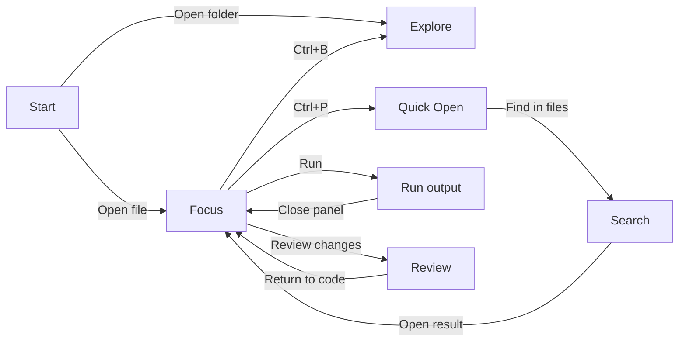

# Quiet Workbench: earlier LightLine visual concept

Open [the interactive prototype](workbench-prototype.html) in a browser. The screen buttons and controls inside the mock application change the view. The prototype is a design artifact; it does not change the Rust editor.

Static screen previews: [Start](screens/welcome.png) · [Focus](screens/focus.png) · [Project](screens/explore.png) · [Quick Open](screens/quick.png) · [Search](screens/search.png) · [Run](screens/run.png) · [Review](screens/review.png).

## The idea

**Keep code as the stable surface. Bring other tools into view for a task, then let them leave.** This gives the editor an identity beyond a familiar explorer-editor-terminal arrangement. The interface can grow into an IDE without requiring every future subsystem to run or occupy space at startup.

The current screenshot is a useful baseline. The dark canvas and readable code already work. The next visual gains are clearer hierarchy, a deliberate file location, a consistent status bar, more useful use of horizontal space, and sharper typography. The status bar should reserve its own space and never share pixels with the last code row. A transient event such as “Opened file” should appear as a short-lived notification; the persistent status bar should show durable state.

| In the current screenshot | In this concept |
| --- | --- |
| File name in a plain tab | Active tab accent plus a location breadcrumb |
| Last action occupies the status bar | Stable path and cursor information; short-lived messages appear separately |
| One full-width editor surface | Focused code column, with a contextual drawer when a task needs it |
| Bright native title bar above dark content | A coordinated app header, introduced only after native window behavior is tested |

## Screen flow

| Screen | Purpose | What appears | Planned phase |
| --- | --- | --- | --- |
| Start | Pick the next action | Open file/folder and recent workspaces | UI polish |
| Focus | Write and read code | Tabs, breadcrumb, code, stable status | UI polish |
| Explore | Navigate a project | Contextual file drawer beside code | Project editor |
| Quick Open | Jump to a file or action | Small overlay above the current editor | Navigation |
| Find | Search across a project | Result drawer and code preview | Project search |
| Run | See task feedback | Bottom output drawer, opened on demand | Developer tooling |
| Review | Understand a change | Compact change list and side-by-side diff | Git integration |

The current editor already has tabs and syntax coloring. File trees, project search, task output, and Git shown in the prototype are future screens.

## Layout rules

- **Default:** no permanent activity rail or sidebar. The active file owns the center of the window.
- **One location cue:** show `workspace / folder / file` just below tabs. The full path is available on hover or in file details.
- **Tabs:** the active tab gets one warm underline; inactive tabs recede. A dirty dot is visible before the filename.
- **Status:** stable file/workspace information on the left; cursor, indentation, encoding, and language on the right. Short-lived messages use a toast or output area.
- **Drawers:** project and search share a left drawer area. Run output uses a bottom drawer. They remember size and can close with a single action.
- **Text:** use a crisp monospaced font, roughly 14 px or larger at 100% scale, with a line height around 1.8. Keep syntax colors restrained; plain code remains legible without color.
- **Color:** graphite surfaces (`#11171c` editor, `#1a2229` chrome), pale text (`#e6edf0`), warm accent (`#e6a772`), quiet blue, green, and purple syntax colors.
- **Accessibility:** all core actions have keyboard paths and visible focus; color never acts as the only signal for dirty state, selection, error, or success.

## Why this direction

Familiar entry points reduce relearning: tabs, a project tree, a command palette, and a docked output area are established editor patterns. [VS Code’s interface guide](https://code.visualstudio.com/docs/editing/getting-started/userinterface) describes those regions and their ability to be hidden. [Zed’s command palette](https://zed.dev/docs/command-palette), [project panel](https://zed.dev/docs/project-panel), and [terminal panel](https://zed.dev/docs/terminal) show how task-specific surfaces can be invoked. [JetBrains’ viewing modes](https://www.jetbrains.com/help/idea/ide-viewing-modes.html) support the value of a focused editor view. This concept combines familiar controls with a quieter default layout; community appeal still needs testing with developers.

## Implementation order

1. Apply the typography, spacing, tab, breadcrumb, and status rules to the existing Windows editor. Keep native window controls until custom chrome is tested for dragging, resizing, DPI, and accessibility.
2. Add the Start and Focus layouts. Preserve startup and typing latency while changing paint code.
3. Build the project drawer and Quick Open when the corresponding workspace features exist.
4. Add search results, run output, and review screens only with their real services. Closed drawers should have no background process cost.

Before adopting the layout, give five developers the prototype and ask them to open a file, switch files, find a symbol, run a task, and return to distraction-free editing. Observe where they hesitate and whether they can find the controls without explanation. Use that evidence to refine the design instead of assuming a community preference.
