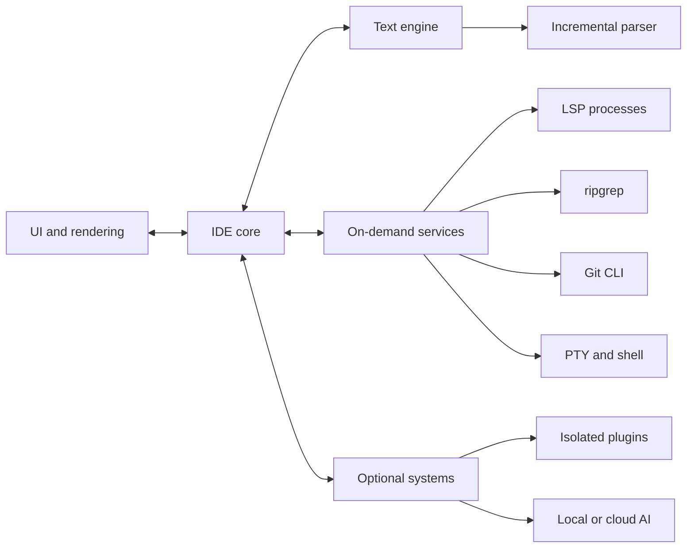

# Custom IDE: v0.1 technical direction

Status: initial architecture, final for now. Date: 2026-09-17.

This document records the intended product and the boundaries we want to preserve as the project grows. Individual libraries, data structures, and performance targets remain open to measurement. It describes a direction, not a claim that every subsystem already exists.

> Do the minimum amount of work necessary, at the latest possible time, without blocking the user's interaction.

## Product goal

Build a native, lightweight, highly responsive developer environment where complexity is opt-in. The editor must remain useful when language servers, Git, indexing, plugins, and AI are inactive. Fast idle behavior, predictable resource use, and low interaction latency are product requirements.

We begin with a real text editor and grow it into a code editor and then an IDE. We should not build a throwaway editor, nor should we build the entire IDE before basic editing is reliable.

```text
Text editor → Code editor → Project editor → IDE
```

## System boundaries



The UI owns pixels, layout, input events, and the visible viewport. The core owns commands, workspaces, editor state, configuration, and sessions. The text engine owns documents, editing operations, cursors, selections, and undo/redo. Background services own expensive or external work. Optional systems must be removable without breaking basic editing.

The text model must not depend on pixel coordinates or a particular GUI toolkit. Rendering consumes a view of document state and paints only the visible region. Tabs and split panes are views of documents; they must not create independent copies of the same file's contents.

Ownership and state changes need explicit rules. UI commands change core state; work that can finish later returns versioned results so stale parsing, search, or LSP responses cannot overwrite newer document state. Rust prevents many memory-safety errors, but it will not prevent duplicate buffers, unbounded caches, unnecessary copies, or a confused ownership model.

## Technology direction

| Area | Initial direction | Decision status |
| --- | --- | --- |
| Primary language | Rust for the core, editor, UI, services, and performance-critical code | Stable principle |
| Target platform | Windows first; other platforms later | Stable near-term scope |
| UI | Prototype GPUI first, then compare with other native Rust approaches | Candidate, not locked |
| Rendering | Native/GPU-assisted, with a custom editor viewport if useful | Benchmark before committing |
| Text buffer | Compare gap buffer, piece table, rope, and rope-like structures | Open |
| Syntax parsing | Tree-sitter with incremental updates | Planned |
| Language intelligence | Existing language servers through LSP | Planned |
| Search | ripgrep behind a search service | Planned |
| Git | Git CLI behind a Git service | Planned |
| Terminal | PTY subsystem with a terminal UI and shell process | Planned |
| Concurrency | Rust threads/async primitives where they keep the UI responsive | Principle; runtime open |
| Persistent cache | SQLite only if a measured need for persistent indexing appears | Conditional |
| Zig | Consider only for a measured bottleneck with a meaningful improvement | Conditional |
| AI and plugins | Optional, isolated subsystems | Later phases |

Rust is the default throughout: native binaries, memory safety, concurrency, and a strong developer-tooling ecosystem fit a long-running editor. We do not add another systems language merely because it is fast. A Zig component would require profiling, an alternative implementation, a benchmarked gain, and a justified FFI boundary.

GPUI is the first framework to investigate because it supports complex native Rust interfaces and GPU-assisted rendering. A prototype must measure startup, idle memory, typing responsiveness, scrolling, rendering, and large-file behavior before we adopt it deeply. If another native approach fits better, we change early. The existing Windows GDI window is a working prototype, not a final UI decision.

## Text engine and rendering

Separate these responsibilities:

```text
Text model: buffer, cursor, selection, undo/redo, edit operations, file state
Rendering: layout, glyphs, syntax colors, cursor, selection, viewport
```

The buffer decision is open. Benchmark insertion and deletion at the beginning, middle, and end of small and large files; line access; navigation; undo memory; parsing integration; and total memory overhead. A rope or rope-like structure is promising, but it must earn its place on our workloads. The current `Vec<String>` model is a prototype and is not a large-file strategy.

Only visible lines should be laid out and painted. A 100,000-line document must not create 100,000 UI widgets. Scrolling changes the viewport and requests work for the newly visible area. Long lines, wrapped lines, selections, cursor movement, and syntax colors need their own measurements; a GPU alone does not guarantee low latency.

Text correctness is foundational. UTF-8 bytes are not characters, and characters are not always user-perceived graphemes. Combining marks, emoji, CJK text, bidirectional text, font shaping, input methods, and LSP position encodings affect cursor movement and selection. File handling must also account for encodings, line endings, external changes, reliable saving, and permissions. Large files may need lazy loading, bounded parsing, and a different line-index strategy.

## Parsing and language support

Tree-sitter will maintain syntax trees incrementally. A small edit should update affected regions instead of reprocessing an entire document. The parser consumes document revisions and publishes highlighting and structural data only for the revision it parsed. Syntax parsing is distinct from language intelligence.

LSP is the boundary to existing language servers. Start with one language, then add others as the client proves reliable:

| Language | Candidate server |
| --- | --- |
| Rust | rust-analyzer |
| Python | pyright |
| C/C++ | clangd |

LSP can provide completion, diagnostics, definition, references, rename, hover, formatting, and code actions. Servers launch only when a relevant file or command needs them. A slow or memory-hungry server must not make typing or scrolling slow. The core must handle server crashes, delayed messages, document versions, cancellation, and position-encoding conversions.

## Project and developer services

Workspace and project loading should be lazy. Opening a project should not trigger a full scan or index before the editor becomes usable. File trees, recent files, project search, and workspace state can appear progressively. File watching, symlinks, case sensitivity, permissions, and path semantics vary by operating system; Windows is the first platform to handle well.

Search begins with a service that invokes ripgrep and streams results to the UI. A persistent index is a later, measured choice. Git begins with a service around the Git CLI; there is no reason to reimplement Git. Build, run, and debug arrive after the editor and project features work.

The terminal eventually needs a real PTY, terminal rendering, and a shell process. PowerShell is relevant on Windows; bash and zsh matter when other platforms are supported. PTY behavior is platform-specific and should remain behind a service boundary.

Expensive work must not block the UI thread. Project scans, search, Git commands, indexing, parsing that exceeds the interaction budget, and language-server communication run in background workers. Use async or threads where they help, not as a blanket design rule. Workers must have bounded queues, cancellation, and ownership rules so concurrency does not turn into uncontrolled background activity.

SQLite is activated only if persistent incremental indexing or another measured need justifies it. Small projects should not pay startup, memory, or disk costs for an index they never use.

## Optional systems and isolation

AI is outside the core. With AI disabled, the editor starts no AI process, model, embedding job, context index, or agent. Local and cloud AI may be separate choices later. No core editing operation may depend on AI being available.

Plugins use a defined API and controlled capabilities. Potentially expensive or untrusted plugins should run in isolated processes so a plugin crash does not crash the editor. IPC and process isolation have costs, so the design and permissions come later. Plugins must not receive unlimited access to the core merely for convenience.

Subsystem failures must be contained: a failed language server, search process, plugin, or AI feature should leave documents editable and savable.

## Performance discipline

Performance is a constraint on each architectural decision, not a cleanup phase. We do not initialize unnecessary systems at startup, redo unaffected work after a local edit, or run expensive operations on the UI thread. We benchmark before optimizing and compare before/after measurements on the same hardware and workload.

| Measure | Target | Scenario to record |
| --- | --- | --- |
| Cold and warm startup | TBD | Process launch to usable editor |
| Idle memory and CPU | TBD | Empty window and open project after settling |
| Typing latency | TBD | Key event to visible paint, including tail latency |
| Scrolling | TBD | Frame times in small and large files |
| File open | TBD | 10 KB, 100,000 lines, and very large files |
| Search | TBD | Query to first and complete results in representative projects |
| Project loading | TBD | Time until usable in a 100,000-file workspace |
| Background activity | TBD | CPU, disk I/O, and processes while idle |

Targets remain TBD until we benchmark existing editors and target hardware. Record hardware, OS scaling, file/project fixtures, cold versus warm runs, and percentiles where latency matters. The current 100,000-line document-only measurement is in the README; it is not a UI latency budget. A 500 MB file is a distinct workload that will need bounded memory and work, not merely the same path with a larger input.

## Roadmap

Version labels describe sequence, not release promises.

| Stage | Intended scope |
| --- | --- |
| v0.1 | Native window, correct text editing, files, open/save, tabs, search, syntax highlighting |
| v0.2 | Project/workspace, file tree, recent files |
| v0.3 | Tree-sitter-backed incremental parsing and highlighting |
| v0.4 | LSP client and one language server first |
| v0.5 | Git CLI integration and terminal |
| v0.6 | Debugger |
| v0.7 | Isolated plugin system |
| v0.8 | Optional AI subsystem |

The stage order is more important than these numbers. Syntax highlighting can begin with a small implementation in v0.1 and move to Tree-sitter in v0.3. Later languages follow after the first LSP integration is stable.

The following are outside the v0.1 target: AI, plugins, debugger, broad language support, cloud sync, collaboration, extension marketplace, complex indexing, and a built-in package manager.

### Current implementation versus v0.1 target

The repository currently contains a Windows Rust editor prototype with one document, UTF-8 open/save, editing, undo/redo, selection, clipboard commands, in-file find, and visible-line GDI painting. It includes a document benchmark and an initial test set. It does **not** yet include tabs, split panes, project-wide search, syntax highlighting, GPUI, Tree-sitter, LSP, Git, or a terminal. This gap is intentional and should remain visible in planning and changelogs.

## Decision rules

1. Keep basic editing useful and responsive without optional services.
2. Start a subsystem only when a user action or open document needs it.
3. Update only affected state when a document changes.
4. Keep slow work off the UI thread and discard stale results.
5. Bound memory, queues, caches, and background work.
6. Keep text state separate from rendering and external integrations.
7. Isolate optional and failure-prone components.
8. Benchmark on real workloads before choosing data structures, frameworks, or optimizations.
9. Make Windows reliable first; expand platforms deliberately.
10. Revise library choices when evidence changes, while preserving these boundaries.
